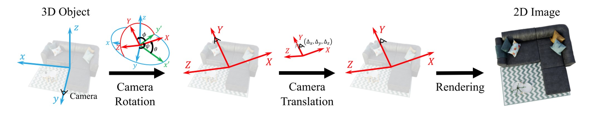

# **ViewFool: Evaluating the Robustness of Visual Recognition to Adversarial Viewpoints** 

This repository contains the code and datasets for the paper [ViewFool: Evaluating the Robustness of Visual
Recognition to Adversarial Viewpoints]() (NeurIPS2022). 

by [Yinpeng Dong](https://ml.cs.tsinghua.edu.cn/~yinpeng/), [Shouwei Ruan](https://github.com/Heathcliff-saku), [Hang Su](https://www.suhangss.me/), [Caixin Kang](https://github.com/kkkcx), [Xingxing Wei](https://sites.google.com/site/xingxingwei1988/) and [Jun Zhu](https://ml.cs.tsinghua.edu.cn/~jun/index.shtml)


## **⚙️ 1. Prerequisites**

* Python (3.7.11)
* Pytorch (1.11.0)
* torchvision (0.12.0)
* timm (0.5.4)
* pytorch-lighting(1.5.2)

## **💾 2. ImageNet-V**


*Imagenet-v* is a new out-of-distribution dataset for benchmarking viewpoint robustness of visual classifiers. it's generated by *viewfool*, and has 10,000 renderings of 100 objects with images of size 400*400 

### **2.1 Data Release**
We used 100 3d objects from [blenderkit](https://www.blenderkit.com/) contained within the ImageNet category, and we published the data needed to train NeRF, which can be obtained through this link:

* [Download original data for training NeRF](https://drive.google.com/file/d/1MvDUPAcYS8XBOJ7DyHBMA3PKoBa7XJU-/view?usp=sharing)

The full ImageNet-V renderings can be obtained from the following link:
* [Download ImageNet-V](https://drive.google.com/file/d/1i6QBGzERxo2br33WwIGi6GyUZasqCWp-/view?usp=sharing)

### **2.2 ImageNet-V Benchmark**

Using ImageNet-V we evaluated the viewpoint robustness of **40** classifiers with different diverse architectures, objective functions, and data augmentations. 

Their performance under Imagenet-v compared to Natural viepoints renderings is as follows:


| Classifier  |  Natural accuracy (%) | ImageNet-V(ours) accuracy (%) |
| :-----------: | :-----------: | :-----------: |
| [vgg16](https://arxiv.org/abs/1409.1556)                  |  60.55    |13.47
| [vgg19](https://arxiv.org/abs/1409.1556)                  |  62.81    |11.83
| [resnet18](https://arxiv.org/abs/1512.03385)               |  61.08    |15.15
| [resnet34](https://arxiv.org/abs/1512.03385)               |  68.08    |14.09
| [resnet50](https://arxiv.org/abs/1512.03385)               |  78.11    |23.56
| [resnet101](https://arxiv.org/abs/1512.03385)              |  81.19    |30.15
| [resnet152](https://arxiv.org/abs/1512.03385)              |  82.16    |30.41
| [inception_v3](https://arxiv.org/abs/1512.00567)           |  60.59    |17.99
| [inception_v4](https://arxiv.org/abs/1602.07261)           |  63.65    |13.08
| [inception_resnet_v2](https://arxiv.org/abs/1602.07261)   |  51.85    |18.00
| [densenet121](https://arxiv.org/abs/1608.06993)            |  73.36    |20.93
| [densenet169](https://arxiv.org/abs/1608.06993)            |  70.75    |19.11
| [densenet201](https://arxiv.org/abs/1608.06993)            |  70.05    |19.83
| [efficientnet_b0](https://arxiv.org/abs/1905.11946v5)        |  70.06    |17.37
| [efficientnet_b1](https://arxiv.org/abs/1905.11946v5)        |  73.36    |18.35
| [efficientnet_b2](https://arxiv.org/abs/1905.11946v5)        |  74.88    |24.54
| [efficientnet_b3](https://arxiv.org/abs/1905.11946v5)        |  75.43    |25.51
| [efficientnet_b4](https://arxiv.org/abs/1905.11946v5)        |  76.33    |24.31
| [mobilenetv2_120d](https://arxiv.org/abs/1801.04381)       |  72.73    |20.89
| [mobilenetv2_140](https://arxiv.org/abs/1801.04381)        |  71.60    |18.90
| [vit_base](https://arxiv.org/abs/2010.11929)               |  62.28    |20.41
| [vit_large](https://arxiv.org/abs/2010.11929)              |  86.04    |37.67
| [deit_tiny](https://arxiv.org/abs/2012.12877)              |  62.94    |18.88
| [deit_small](https://arxiv.org/abs/2012.12877)             |  76.20    |23.51
| [deit_base](https://arxiv.org/abs/2012.12877)              |  81.31    |27.00
| [swin_tiny](https://arxiv.org/abs/2103.14030)              |  78.80    |26.58
| [swin_small](https://arxiv.org/abs/2103.14030)             |  82.95    |30.23
| [swin_base](https://arxiv.org/abs/2103.14030)              |  88.78    |40.38
| [swin_large](https://arxiv.org/abs/2103.14030)             |  89.97    |47.40
| [mixer_b16](https://proceedings.neurips.cc/paper/2021/hash/cba0a4ee5ccd02fda0fe3f9a3e7b89fe-Abstract.html)              |  49.66    |9.63
| [mixer_l16](https://proceedings.neurips.cc/paper/2021/hash/cba0a4ee5ccd02fda0fe3f9a3e7b89fe-Abstract.html)              |  44.52    |8.56
| [resnet50_l2_robust_eps=1.0](https://arxiv.org/abs/2007.08489v2) |  38.12    |8.21
| [resnet50_l2_robust_eps=3.0](https://arxiv.org/abs/2007.08489v2) |  31.72    |5.78
| [resnet50_l2_robust_eps=5.0](https://arxiv.org/abs/2007.08489v2) |  26.89    |6.04
| [mae_vitb](https://arxiv.org/abs/2111.06377)               |  74.67    |29.33
| [mae_vitl](https://arxiv.org/abs/2111.06377)               |  79.00    |40.10
| [mae_vith](https://arxiv.org/abs/2111.06377)               |  83.67    |49.85
| [resnet50_augmix](https://arxiv.org/abs/1912.02781v1)        |  73.34    |18.87
| [resnet50_deepaugment](https://arxiv.org/abs/2006.16241)   |  71.25    |19.65
| [resnet50_augmix+deepaugment](https://arxiv.org/abs/2006.16241) |  72.98     |23.10

### 2.3 Evaluate ImageNet-V on pretrained or your classifier

We provide evaluation scripts for 40 pre-trained models You can use your own classifier for evaluation by replacing the relevant weight paths in the code or defining the model

Testing the imagenet-v dataset in classifiers with prtrained weight can be done with the following command:
```
python ./NeRF/Imagenet_v_benchmark.py --model {classifier_name}
```
There are currently supported classifiers:

`'vgg16 ', 'vgg19', 'densenet121 ', 'densenet169', 'densenet201', 'inception_v3 ', 'inception_v4', 'inception_resnet_v2 ', 'resnet18', 'resnet34', 'resnet50', 'resnet101', 'resnet152', 'efficientnet_b0 ', 'efficientnet_b1', 'efficientnet_b2', 'efficientnet_b3 ', 'efficientnet_b4 ', 'mobilenetv2_120d', 'mobilenetv2_140 ', 'mixer_b16_224 ', 'mixer_l16_224 ', 'vit_base_patch16_224 ', 'vit_large_patch16_224 ', 'deit_base_distilled_patch16_224', 'deit_base_patch16_224 ', 'deit_small_patch16_224 ', 'deit_tiny_patch16_224 ', 'swin_base_patch4_window7_224 ', 'swin_large_patch4_window7_224 ', 'swin_small_patch4_window7_224 ', 'swin_tiny_patch4_window7_224', 'resnet_augmix ', 'resnet_deepaugment', 'resnet_augmix_deepaugment', 'resnet_l2_robust_eps=1.0', 'resnet_l2_robust_eps=3.0', 'resnet_l2_robust_eps=5.0', 'mae_vitb', 'mae_vitl', 'mae_vith'`

## **⚔️ 3. ViewFool**



We propose *ViewFool*, a novel method to find adversarial viewpoints
that mislead visual recognition models. By encoding real-world objects as neural radiance fields (NeRF), ViewFool characterizes a distribution of diverse adversarial viewpoints under an entropic regularizer

Therefore, executing the ViewFool attack requires first obtaining the NeRF weight of the object

### 3.1 Training NeRF for Objects

You can view [nerf_pl](https://github.com/kwea123/nerf_pl) understand the detailed training process, and in general, you can use the following commands:


```
python ./NeRF/train.py --dataset_name blender --root_dir "./training_data/apple_2" --N_importance 64 --img_wh 400 400 --noise_std 0 --num_epochs 30 --batch_size 4096 --optimizer adam --lr 1e-4 --lr_scheduler steplr --decay_step 2 4 8 --decay_gamma 0.5 --exp_name "apple_2" 
```

`--root_dir` is the path for training data, Data can be downloaded via the link in 2.1

After the training is complete, the weight file will be found in `./NeRF/ckpts/{exp_name}`

### 3.2 Attack: Optimizing adversarial viewpoint

Next, we provide two attack methods:

* **Random**: Randomly generates renderings of objects at various viewpoints within the angular range

```
python NeRF/attack_randomsearch.py --dataset_name blender_for_attack --scene_name 'AP_random/apple_2' --img_wh 400 400 --N_importance 64 --ckpt_path './NeRF/ckpts/apple_2/epoch=29.ckpt' --num_sample 100 --optim_method random --search_num 6
```

* **ViewFool**: Use NES under the entropic regularizer to optimize viewpoint parameters and generate renderings under adversarial viewpoint distributions

```
python NeRF/ViewFool.py --dataset_name blender_for_attack --scene_name  'resnet_AP_lamba0.01/apple_2' --img_wh 400 400 --N_importance 64 --ckpt_path './NeRF/ckpts/apple_2/epoch=29.ckpt' --optim_method NES --search_num 6 --popsize 51 --iteration 100 --mu_lamba 0.01 --sigma_lamba 0.01 --num_sample 100 --label_name 'Granny Smith' --label 948
```

`--ckpt_path` is object's NeRF weights path
and `--label_name`/`--label` is object's label in ImageNet-1K
, You can adjust the intensity of the entropy regular term by modifying `--mu_lamba`  and  `--sigma_lamba`, In the paper we use 0.01

You can modify the optimize parameters by modifying `--search_num`:
| search_num  | optimize parameters |
| ----------- | ----------- |
| `6`     | both Angle and position (ψ, θ, ϕ, ∆x, ∆y, ∆z)      |
| `123`   | only Angle (ψ, θ, ϕ) |
| `456`   | only position (∆x, ∆y, ∆z) |

Using ours default parameters (100epoch & 51popsize) to attack an object will take about 4.5 gpu hours(in NVIDIA 3090). During the running process, the current average loss and distribution entropy will be printed in real time. After the running, the attack angle parameters and the evaluation results on the target model will be obtained.


## **Citation**

If you find our methods useful or use the imagenet-v dataset, please consider citing:
```
...
```

This project uses  Unofficial implementation of NeRF (Neural Radiance Fields) using pytorch (pytorch-lightning): 
```
@misc{queianchen_nerf,
  author={Quei-An, Chen},
  title={Nerf_pl: a pytorch-lightning implementation of NeRF},
  url={https://github.com/kwea123/nerf_pl/},
  year={2020},
}
```
Thanks to estool, we have adopted the implementations of NES:
```
@article{ha2017evolving,
  title   = "Evolving Stable Strategies",
  author  = "Ha, David",
  journal = "blog.otoro.net",
  year    = "2017",
  url     = "http://blog.otoro.net/2017/11/12/evolving-stable-strategies/"
}
```

## **😊 Contact**
If you have any questions or suggestions about the paper or code, look forward to your contact with us:

* Yinpeng Dong: dyp17@mails.tsinghua.edu.cn
* Shouwei Ruan: shouweiruan@buaa.edu.cn